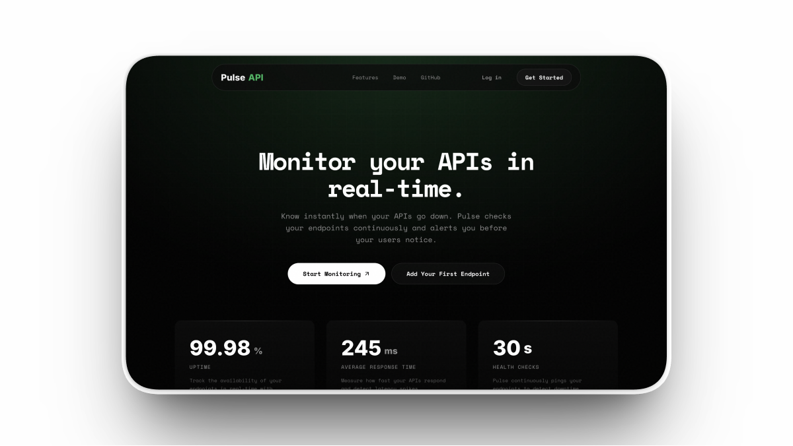

# PulseAPI

API uptime monitoring that actually tells you when things break.

PulseAPI watches your HTTP endpoints on a set interval, logs every response, and sends you an email the moment something goes down. No agents to install, no complex configuration. Add a URL, set the check frequency, and it handles the rest.



---

## What it does

- Monitors any public HTTP/HTTPS endpoint at configurable intervals (default: 60s)
- Records status codes, response times, and uptime percentage for every endpoint
- Sends email alerts when an endpoint goes down, and a recovery notice when it comes back
- Supports Google OAuth and email/password authentication
- Per-user endpoint management with activity logs and historical ping data

## Tech Stack

**Frontend:** React 19, TypeScript, Vite, Tailwind CSS, Framer Motion, React Router v7

**Backend:** Express 5, TypeScript, Prisma ORM, PostgreSQL (Neon), Better Auth, Resend, Zod

**Runtime:** Bun

## Project Structure

```
PulseAPI/
├── Backend/
│   ├── index.ts                  # Express server entry point
│   ├── db.ts                     # Prisma client setup
│   ├── prisma/schema.prisma      # Database schema
│   ├── src/
│   │   ├── routes/
│   │   │   ├── userRouter.ts     # User settings and dashboard
│   │   │   └── endpointRouter.ts # Endpoint CRUD and ping history
│   │   ├── services/
│   │   │   └── monitor.ts        # Background monitoring loop + email alerts
│   │   ├── middleware/            # Auth token validation
│   │   └── validator/            # Zod request schemas
│   └── utils/auth.ts             # Better Auth config (Google OAuth, OTP)
├── Frontend/
│   └── src/
│       ├── pages/
│       │   ├── Home.tsx           # Landing page
│       │   ├── Dashboard.tsx      # Endpoint management
│       │   ├── Logs.tsx           # Ping history and uptime stats
│       │   ├── Settings.tsx       # User preferences, email toggle
│       │   ├── Login.tsx          # Email/password + Google login
│       │   ├── Signup.tsx         # Registration
│       │   ├── VerifyEmail.tsx    # OTP verification
│       │   └── ForgotPassword.tsx # Password reset
│       ├── components/
│       └── lib/                   # Auth client config
├── testsprite_tests/              # AI-generated test cases (TestSprite)
└── README.md
```

## How Monitoring Works

The backend runs a polling loop every 5 seconds. For each endpoint, it checks whether enough time has passed since the last ping based on that endpoint's configured interval. If a check is due:

1. Sends an HTTP request to the endpoint URL with a 10-second timeout
2. Compares the response status code against the expected status
3. Stores the result (status, response time, status code) as a Ping record
4. If the endpoint just went down (was not already marked DOWN), sends an alert email to the owner
5. If the endpoint just recovered (was DOWN, now UP), sends a recovery email
6. Updates the endpoint's current status in the database

Alerts only fire on state transitions to avoid spamming inboxes during prolonged outages.

## Database Schema

Five core models:

- **User** -- account info, email alert preference, linked endpoints
- **Endpoint** -- URL, method, expected status, check interval, current status
- **Ping** -- individual check result (status, response time, status code, timestamp)
- **Session / Account** -- auth sessions and OAuth provider data
- **ApiKey** -- API key management per user

## Local Setup

### Prerequisites

- [Bun](https://bun.sh) installed
- PostgreSQL database
- [Resend](https://resend.com) API key for email alerts

### Backend

```bash
cd Backend
cp .env.example .env   # fill in your database URL, Resend key, auth secrets
bun install
bunx prisma generate
bunx prisma db push
bun run index.ts
```

### Frontend

```bash
cd Frontend
bun install
bun run dev
```

The frontend runs on `http://localhost:5173` and the backend on `http://localhost:3000`.

### Environment Variables

```
DATABASE_URL=           # PostgreSQL connection string
PORT=3000
BETTER_AUTH_SECRET=     # Random secret for session signing
BETTER_AUTH_URL=http://localhost:3000
RESEND_API_KEY=         # From resend.com dashboard
RESEND_FROM_EMAIL=      # Verified sender (e.g. alerts@yourdomain.com)
GOOGLE_CLIENT_ID=       # Google OAuth (optional)
GOOGLE_CLIENT_SECRET=   # Google OAuth (optional)
```

## Testing

Test cases are generated using [TestSprite MCP](https://testsprite.com) and located in the `testsprite_tests/` directory. These cover API endpoint validation, monitoring service behavior, and authentication flows.

## License

MIT
