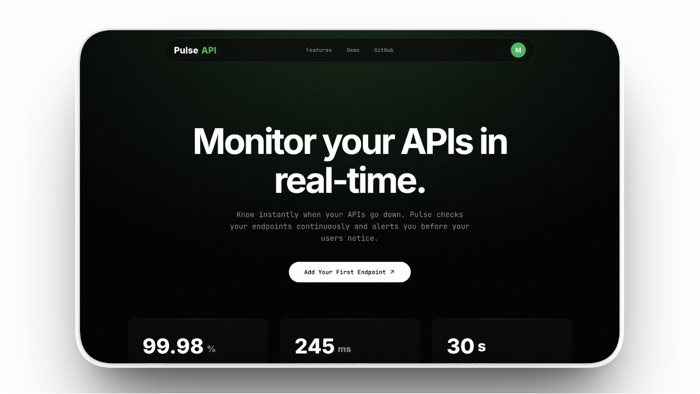

# PulseAPI

Real-time API uptime monitoring. Add an endpoint. Pulse handles the rest.



## Demo

[](https://www.youtube.com/watch?v=L75pejYGAmE)

## What is PulseAPI?

PulseAPI is a full-stack API monitoring platform that continuously checks your HTTP endpoints and alerts you the moment something goes down. It tracks response times, status codes, and uptime history — giving developers a single dashboard to understand the health of their APIs.

Built as a solo project for the [TestSprite Hackathon](https://www.testsprite.com/hackathon).

## Features

- **Uptime Monitoring** — Health checks at configurable intervals (1min / 5min / 1hr)
- **30-Day Uptime Chart** — Visual day-by-day uptime bars for every endpoint
- **Email Alerts** — Instant down/recovery notifications via Resend
- **Shareable Status Pages** — One-click public status page per endpoint
- **Activity Logs** — Full ping history with status codes, response times, and timestamps
- **Auth** — Email/password with OTP verification + Google OAuth, seamless post-signup flow
- **Auto-Refresh** — Dashboard polls for live status updates without manual reload

## Tech Stack

| Layer    | Tech                                                      |
| -------- | --------------------------------------------------------- |
| Frontend | React, TypeScript, Vite, Framer Motion, React Router      |
| Backend  | Express, TypeScript, Prisma ORM, Better Auth, Resend, Zod |
| Database | PostgreSQL                                                |
| Runtime  | Bun                                                       |

## How It Works

1. Add your API endpoint and set a check interval
2. Pulse pings it automatically and records every response
3. If it goes down, you get an email. When it recovers, another email
4. View uptime history, response times, and status on your dashboard or a public status page

## Project Structure

```
PulseAPI/
├── Backend/
│   ├── index.ts                  # Express server entry
│   ├── prisma/schema.prisma      # Database schema
│   ├── src/
│   │   ├── routes/               # API routes (endpoints, auth, public status)
│   │   ├── services/monitor.ts   # Background monitoring loop + email alerts
│   │   ├── middleware/            # Session validation
│   │   └── validator/            # Zod request schemas
│   └── utils/auth.ts             # Better Auth config (OAuth, OTP, sessions)
├── Frontend/
│   └── src/
│       ├── pages/                # All pages (Dashboard, Logs, StatusPage, Auth)
│       ├── components/           # Shared components (Navbar, UptimeBar)
│       └── lib/auth.ts           # Auth client
├── testsprite_tests/             # AI-generated test cases (TestSprite MCP)
└── README.md
```

## Testing

Test cases are generated using [TestSprite MCP](https://testsprite.com) — an AI testing agent that auto-generates comprehensive test suites. All generated tests live in the `testsprite_tests/` directory covering API endpoint validation, monitoring service behavior, and authentication flows.

## Local Setup

**Prerequisites:** [Bun](https://bun.sh), PostgreSQL, [Resend](https://resend.com) API key

```bash
# Backend
cd Backend
cp .env.example .env    # fill in your values
bun install
bunx prisma generate
bunx prisma db push
bun run index.ts

# Frontend (new terminal)
cd Frontend
bun install
bun run dev
```

Frontend: `http://localhost:5173` — Backend: `http://localhost:3000`

### Environment Variables

```
DATABASE_URL=
PORT=3000
BETTER_AUTH_SECRET=
BETTER_AUTH_URL=http://localhost:3000
RESEND_API_KEY=
RESEND_FROM_EMAIL=
GOOGLE_CLIENT_ID=
GOOGLE_CLIENT_SECRET=
```

## License

MIT
